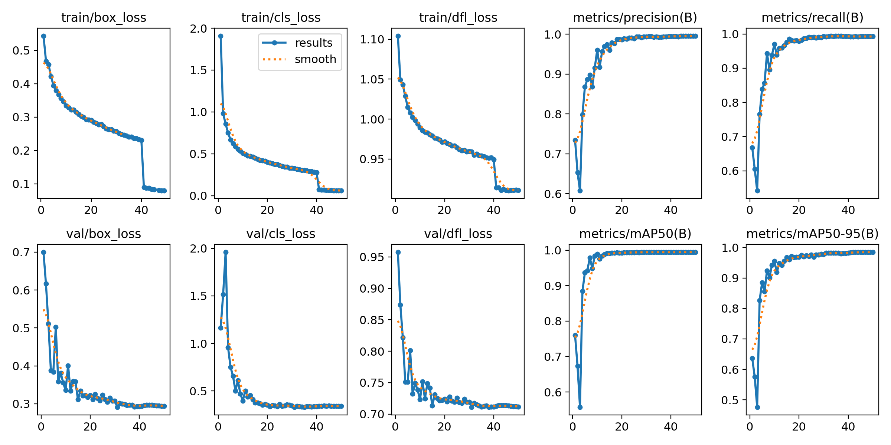
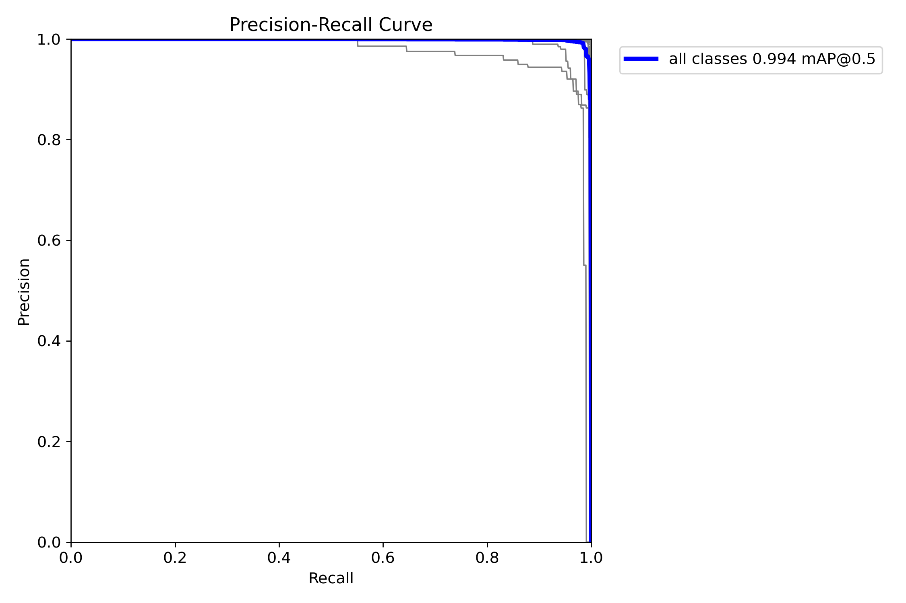
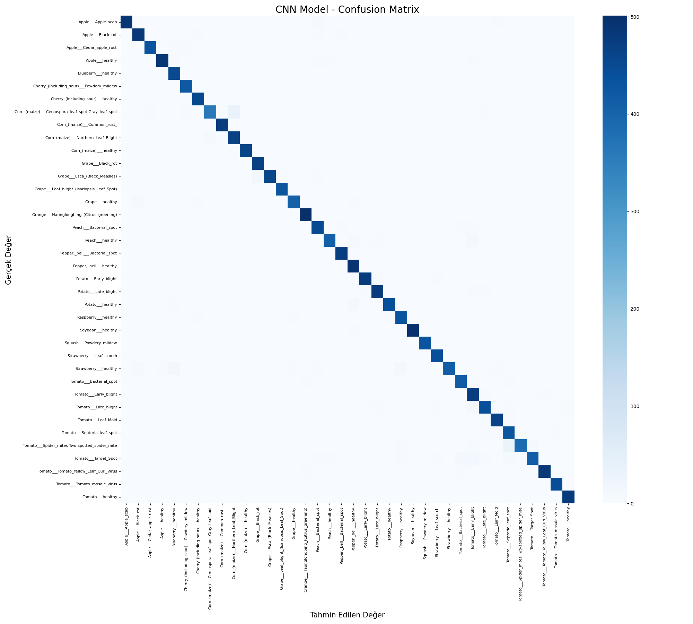

# 🌱 Uçtan Uca Bitki Hastalıkları Tespiti ve Sınıflandırması: YOLOv8 & ResNet18 (Deep Learning)

Bu proje, PlantVillage veri seti kullanılarak 38 farklı bitki sınıfı ve hastalığını yüksek doğrulukla tespit etmek için geliştirilmiş kapsamlı bir yapay zeka sistemidir. Proje, problemi çözmek için derin öğrenmenin iki farklı ve güçlü yaklaşımını (Nesne Tespiti ve Görüntü Sınıflandırma) bir araya getirmektedir.

## 🚀 Proje Özeti
* **Faz 1 (Nesne Tespiti):** YOLOv8 Nano modeli ile yaprak üzerindeki hastalık bölgelerinin kutulanarak (Bounding Box) lokalize edilmesi.
* **Faz 2 (Görüntü Sınıflandırma):** PyTorch kullanılarak sıfırdan inşa edilmiş ResNet18 (CNN) mimarisi ile bitki türü ve spesifik hastalık seviyesinin sınıflandırılması.
* **Veri Seti:** 54.000+ görsel (PlantVillage - Kagglehub)
* **Sınıf Sayısı:** 38 (Elma Pası, Domates Küfü, Sağlıklı vb.)

---

## 🎯 Faz 1: YOLOv8 ile Endüstriyel Tespit (Object Detection)
İlk aşamada modelin hastalıklı bölgeleri fiziksel olarak lokalize etmesi ve gerçek dünya koşullarına (Robust) dayanıklı olması hedeflenmiştir. Eğitim, Google Colab T4 GPU üzerinde ~3.7 saat sürmüştür.

* **Başarı Oranı:** mAP50: %99.4 | mAP50-95: %98.5

### Performans Analizi (YOLOv8)
Model 50 epoch boyunca aşırı öğrenmeye (overfitting) düşmeden istikrarlı bir şekilde gelişmiştir.

* **Eğitim Kayıpları ve Başarı Gelişimi:**


* **Karmaşıklık Matrisi (Confusion Matrix):** Köşegen üzerindeki koyu mavi hat, modelin 38 sınıf arasında neredeyse hiç hata yapmadığını, arka planla (background) hastalıkları mükemmel ayrıştırdığını kanıtlamaktadır.


* **Precision-Recall (Kesinlik-Duyarlılık) Dengesi:** Modelin "yanlış alarm vermeme" (Precision) ve "hastalıkları kaçırmama" (Recall) dengesi 1.0 tavan seviyesine ulaşmıştır.


---

## 🧠 Faz 2: Gelişmiş CNN Mimarisi (ResNet18)
Sadece hastalıklı bölgeyi bulmakla yetinilmeyip, problemi akademik ve algoritmik bir derinlikle çözmek adına PyTorch kullanılarak bir Görüntü Sınıflandırma ağı tasarlanmıştır.

### Mimari Seçimi ve Mühendislik Yaklaşımı
Donanım kısıtlamaları (VRAM ve GPU süre limitleri) ve zaman maliyeti göz önüne alınarak, sıfırdan devasa bir ağ eğitmek yerine endüstri standardı olan **Transfer Learning (Transfer Öğrenme)** stratejisi benimsenmiştir. 
* ImageNet üzerinde eğitilmiş **ResNet18** mimarisi kullanılmış, son katmanlar (Fully Connected Layers) 38 sınıfa göre özelleştirilerek (Fine-tuning) eğitilmiştir. 
* Modelin gerçek dünya şartlarına dayanıklı olması için kapsamlı **Data Augmentation** (Döndürme, Renk Sapması, Işık Oyunları) uygulanmıştır.

### Test ve Doğrulama Metrikleri (17.572 Test Görseli Üzerinde)
CNN modelimiz, test verisi üzerinde ezberlemeden (overfitting olmadan) muazzam bir genelleme yeteneği göstermiştir:
* **Genel Doğruluk (Accuracy): %97.00**
* **Macro Avg F1-Score:** %0.97
* **Öne Çıkan Sınıflar:** `Soybean_healthy` (%100), `Corn_Common_rust` (%99), `Tomato_Leaf_Mold` (%99).

* **CNN Karmaşıklık Matrisi:**


---

## 💻 Kurulum ve Kullanım

### Gereksinimler
Projeyi kendi ortamınızda (yerel bilgisayarınızda) çalıştırmak için gerekli kütüphaneleri yükleyin:
```bash
pip install -r requirements.txt