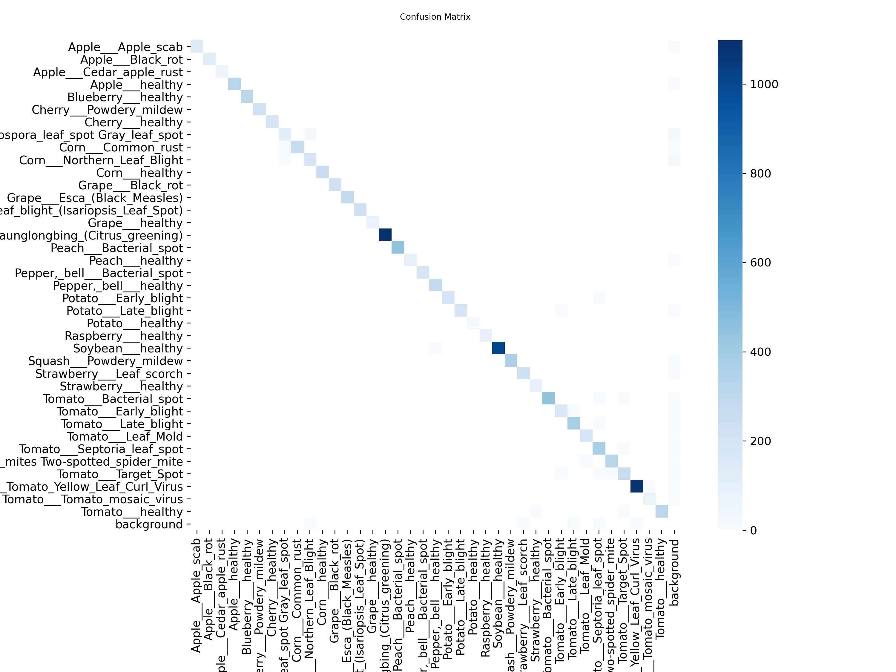

# 🌱 YOLOv8 ile Endüstriyel Bitki Hastalığı Tespiti (PlantVillage)

Bu proje, PlantVillage veri seti kullanılarak 38 farklı bitki sınıfı ve hastalığını %99.4 mAP (Ortalama Hassasiyet) skoruyla tespit eden, gerçek dünya koşullarına (Robust) dayanıklı bir derin öğrenme modelidir.

## 🚀 Proje Özeti
* **Model:** YOLOv8 Nano (yolov8n)
* **Veri Seti:** PlantVillage (Kagglehub üzerinden entegre)
* **Sınıf Sayısı:** 38 (Elma Pası, Domates Küfü, Sağlıklı vb.)
* **Eğitim Süresi:** ~5 Saat (Google Colab T4 GPU)
* **Başarı Oranı:** mAP50: %99.4 | mAP50-95: %98.5

## 📊 Performans Analizi (Metrics)

Modelin ne kadar kararlı öğrendiğini aşağıdaki grafiklerden inceleyebilirsiniz:

### 1. Eğitim Kayıpları ve Başarı Gelişimi (Results)
Model 50 epoch boyunca aşırı öğrenmeye (overfitting) düşmeden istikrarlı bir şekilde gelişmiştir.

### 2. Karmaşıklık Matrisi (Confusion Matrix)
Köşegen üzerindeki koyu mavi hat, modelin 38 sınıf arasında neredeyse hiç hata yapmadığını, arka planla (background) hastalıkları mükemmel ayrıştırdığını kanıtlamaktadır.

### 3. Precision-Recall (Kesinlik-Duyarlılık) Dengesi
Modelin "yanlış alarm vermeme" (Precision) ve "hastalıkları kaçırmama" (Recall) dengesi 1.0 tavan seviyesine ulaşmıştır.

## 💻 Kurulum ve Kullanım
Projeyi kendi bilgisayarınızda çalıştırmak için:
1. `pip install -r requirements.txt` komutunu çalıştırın.
2. Tahmin yapmak için: `python predict.py` komutunu kullanın.
